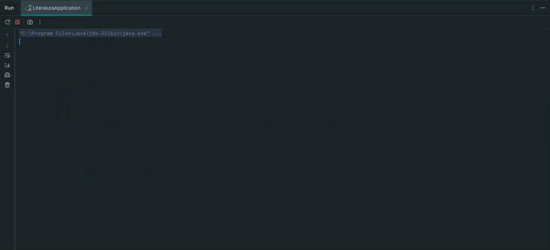

# Challenge 3 LiterAlura


 


## Introducción

El programa [Oracle Next Education (ONE)](https://www.oracle.com/latam/education/oracle-next-education/) es un programa de educación, inclusión y empleabilidad que forma a personas en tecnología y las conecta con el mercado laboral con el apoyo de empresas asociadas.

Es un programa gratuito que dura 12 meses. Abre inscripciones 2 veces al año donde las personas pueden postular mediante un formulario. Cada generación es enumerada con números arábigos.

El proyecto LiterAlura es el Challenge 3 del programa ONE de Oracle y Alura Latam del grupo G9 que inició en julio 2025. Es el segundo reto de desarrollo de la fase 3 (para estudiantes admitidos en el programa) y tercer reto entre todas las fases después del aprendizaje de los cursos de desarrollo en Java, uso de lambdas, streams, Spring Framework, persistencia de datos y consultas con Spring Data JPA, creación de APIs y consumo desde un proyecto web como Front End.

El reto tiene como finalidad poner a prueba a los estudiantes en 4 puntos: programación Orientada a Objetos en Java con Spring Boot Framework, consumo de APIs, conexión con PostgreSQL, y uso de Git y GitHub.

## Descripción del proyecto

LiterAlura es una aplicación de Escritorio en consola para cargar libros y autores usando el API [Gutendex](https://gutendex.com/), guardarlos en base de datos y realizar consultas para mostrar en pantalla. Elige la opción deseada del menú para buscar, registrar y listar libros de la biblioteca en línea y gratuita conocida como Proyecto Gutenberg.

## Estado del proyecto

El día 23 de febrero del 2026 se lanzó la versión 1 del proyecto empleando el mismo diseño del menú mostrado en el video instructivo.

El proyecto se encuentra en su [versión 1.1.1](#registro-de-cambios).

## Demostración de funcionalidad

El aplicativo imprime el menú de opciones, el usuario selecciona la opción 1 que solicita al usuario el ingreso de un título de libro para realizar la consulta de los datos al API Gutendex; se registra el libro y autor en la base de datos y se imprime en pantalla los datos del libro. Eligiendo la opción 2 el aplicativo imprimirá todos los libros consultados y registrados, y en la opción 3, a su vez, imprimirá todos los autores consultados y registrados. En la opción 4, se imprimirán los autores contemporáneos que vivieron en un determinado año. Finalmente, en la opción 5, está disponible la búsqueda de libros por idioma.

Al término de la ejecución de cada opción, el aplicativo vuelve a solicitar el ingreso de un número de opción del menú, y se repite el bucle hasta que el usuario elige la opción de "Salir".



Siendo que solo en la opción 1 hay consulta al API para la obtención de los datos de libros y autores, mientras que el resto de opciones realizan consulta a base de datos.

## Instalación local

1. Clona el código fuente.

```
git clone https://github.com/PolloRosa/Challenge3-LiterAlura.git
```

O descarga el proyecto haciendo click en el botón verde "Code" y haciendo click en la opción "Download ZIP".

2. Iniciar el IDE IntelliJ IDEA y abrir el proyecto.

3. Crear las variables del entorno `ALURA_DB_HOST`, `ALURA_DB_USER` y `ALURA_DB_PASSWORD`, y llenarlas con los datos correspondientes para la conexión con base de datos.

4. Iniciar el DBMS PostgreSQL y crear la base de datos `literalura`.

5. Ejecutar el proyecto desde la clase `LiteraluraApplication`.

## Tecnologías usadas

* JDK 17.0.13
* IntelliJ IDEA 2025.3.1
* [Spring Boot Framework](https://start.spring.io/)
* Dependencia spring-boot-starter de Maven
* Dependencia spring-boot-starter-data-jpa de Maven
* Dependencia postgresql de Maven
* Dependencia spring-boot-devtools de Maven
* Dependencia jackson-databind de Maven
* [Gutendex](https://gutendex.com/)
* PostgreSQL
* Git para control de versiones

## Registro de cambios

1.1.1 *24 febrero 2026*

* :sparkles: Creación del archivo README.md.

1.1.0 *23 febrero 2026*

* :sparkles: Creación del archivo LICENSE.

1.0 *23 febrero 2026*

* :pencil2: Agrega funcionalidad para verificar coincidencia de nombre del idioma en enum Idioma.
* :pencil2: Cambio de tipo de obtención de datos de FetchType.LAZY a FetchType.EAGER, en clase Autor.
* :pencil2: Agrega consulta para el listado de autores vivos por año en clase AutorRepository.
* :pencil2: Agrega consulta para el listado de libros por idioma en clase LibroRepository.
* :pencil2: Agrega funcionalidad de listado de autores registrados en la opción 3 del menú, listado de autores vivos por año en la opción 4 del menú, y consulta de libros por idioma en la opción 5 del menú, en la clase Principal.
* :pencil2: Agrega validaciones para ingreso de opción numérico válido en el menú, mensajes de listados vacíos, ingreso del año numérico válido, e ingreso de idioma válido, en la clase Principal.

0.4.0 *23 febrero 2026*

* :pencil2: Agrega constructor para convertir objetos DatosLibro en entidades Libro, métodos getters y setters, en la clase Libro.
* :pencil2: Agrega constructor para convertir objetos DatosAutor en entidades Autor, métodos getters y setters, y método agregarLibro para mantener actualizada la relación entre libros y autores, en la clase Autor.
* :pencil2: Agrega soporte para más idiomas en el enum Idioma.
* :sparkles: Agrega clases AutorRepository y LibroRepository para agregar y usar los métodos de persistencia para ambas entidades.
* :pencil2: Agrega funcionalidad de registro de libros y autores en la opción 1 del menú, en la clase Principal.
* :pencil2: Agrega funcionalidad de listado de libros registrados en la opción 2 del menú, en la clase Principal.
* :pencil2: Agrega validaciones para no registrar libros sin autor, para no registrar libros que ya se encuentran registrados, y para no registrar autores que ya se encuentran registrados, en la clase Principal. 

0.3.0 *22 febrero 2026*

* :sparkles: Agrega las variables para la conexión a base de datos, en el archivo application.properties.
* :sparkles: Agrega clases Autor y Libro como entidades para la creación de las tablas en base de datos.

0.2.0 *22 febrero 2026*

* :sparkles: Agrega funcionalidad del menú en la clase Principal.
* :sparkles: Agrega funcionalidad de la opción 1 solo para consulta al API e impresión en pantalla de los datos del libro, en la clase Principal.
* :pencil2: Agrega soporte para más idiomas en el enum Idioma.

0.1.0 *22 febrero 2026*

* :white_check_mark: Crea las clases base para la conexión con el API Gutendex.
* Crea las clases ConsultaDatos y ConsumoAPI para la consulta al API.
* Crea la clase Constantes para almacenar la url del API.
* Crea la clase Principal para probar la consulta de libros al API.
* Crea los records DatosAutor, DatosLibro y DatosResultado para deserializar la respuesta del API.
* Crea el enum Idioma para manejar el idioma.

## Autor

Angela Cáceres @PolloRosa :baby_chick:

## Licencia

El proyecto está bajo la licencia MIT. Puedes usarlo, compartirlo y modificarlo libremente, incluso con fines comerciales. La única condición es que conserves el aviso de derechos de autor original y el texto de la licencia en todas las copias o partes sustanciales del software. 